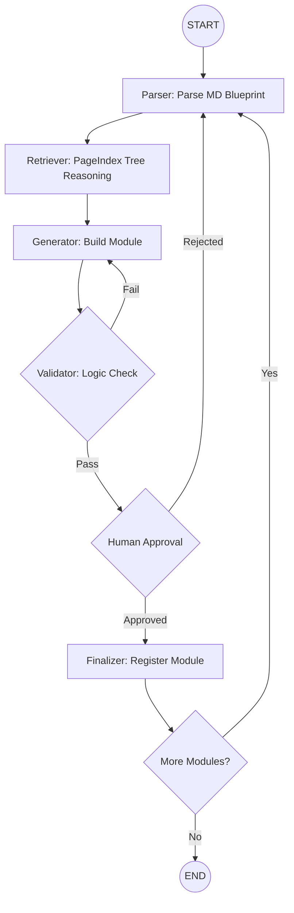

# LangGraph MD & PageIndex Reasoning Design

> **Rule #7 — NO VECTOR EMBEDDINGS FOR RETRIEVAL.** All retrieval uses PageIndex reasoning-based tree search. No pgvector.

For this architecture — Markdown (MD) files as the "blueprint" and PageIndex + Neon as the "knowledge base" — LangGraph is the orchestration layer for all agent workflows.

**All agent code is TypeScript only. No Python.**

## 1. The Architectural Blueprint

Structure your agents into a Tiered Graph:

- **Tier 1: The Architect (LangGraph Node)**: Reads the MD project files. Decomposes MD requirements into a structured "Implementation Plan."
- **Tier 2: The Context Retriever (PageIndex Reasoning)**: Searches PageIndex trees stored in Neon using reasoning-based navigation — LLM reads the tree ToC, identifies relevant node IDs, retrieves only those sections. **No pgvector. No similarity search.**
- **Tier 3: The Feature Nodes (LangGraph Sub-graphs)**: Specialized nodes (Generator, Compliance Checker, Validator) that take one piece of the plan and generate TypeScript/SQL modules.

## 2. Decision-Tree-First Retrieval (98.7% Accuracy)

The retrieval pipeline follows a strict decision tree before agents touch the data:

```
Query arrives
    ↓
1. SQL Metadata Filter (Neon)
   WHERE doc_type, metadata @>, department, year
    ↓ (narrows to candidate docs)
2. Summary Selection (cheap LLM — Haiku)
   Read doc summaries → pick best match
    ↓ (single doc selected)
3. PageIndex Tree Reasoning (Claude Sonnet)
   Navigate tree structure → identify exact node IDs
    ↓ (precise sections retrieved)
4. Answer Generation (Claude Sonnet)
   Generate response from selected nodes only
    ↓
98.7% accuracy achieved → agent team refines to perfect
```

This decision tree runs BEFORE any agent team is involved. The tree search gets to 98.7% accuracy; agents handle the remaining 1.3%.

## 3. Why LangGraph for the ERP Core

Building an ERP involves thousands of interconnected "states" (Accounting ↔ Inventory ↔ Sales).

- **State Persistence**: If the Inventory Agent fails, the system remembers exactly where it was.
- **Deterministic Workflows**: ERPs follow strict rules (e.g., a GL entry must balance). LangGraph enforces these "cycles" where an agent must redo work until it passes validation.
- **Human-in-the-loop (HITL)**: Senior developers approve database schema or security protocols before agents proceed. LangGraph's `interrupt()` is purpose-built for this.

## 4. Leveraging Your Data Sources

- **Markdown Files as "Source of Truth"**: System Prompt constraints. Define the "What."
- **PageIndex Trees in Neon as "Expert Reference"**: Define the "How." Complex documentation, API specs, historical code patterns — all stored as JSONB trees in tenant's Neon DB, retrieved via reasoning-based search.

**Pro Tip:** Use hybrid SQL + tree reasoning (Metadata filter → PageIndex reasoning) for ERP data. Specific variable names or SKU formats are caught by SQL metadata filters before PageIndex reasoning handles the semantic depth.

## 5. Implementation Strategy

| Stage | Agent Responsibility | Tech |
|---|---|---|
| Parsing | Ingest MD files; create a dependency graph of ERP modules | LangGraph + TypeScript |
| Grounding | Query PageIndex trees from Neon for business rules/compliance | PageIndex reasoning (NOT pgvector) |
| Generation | Write TypeScript/SQL code for specific ERP modules | LangGraph (generator node) |
| Validation | Run compliance checks; validate against MD requirements | LangGraph (compliance_checker + validator) |

## 6. The State Schema (TypeScript)

```typescript
import { Annotation } from "@langchain/langgraph";

const ERPStateAnnotation = Annotation.Root({
  project_md: Annotation<string>(),           // The raw MD blueprint
  current_module: Annotation<string>(),       // e.g., "General Ledger" or "Inventory"
  business_rules: Annotation<string[]>({      // Rules from PageIndex tree reasoning
    default: () => [],
    reducer: (_prev, next) => next,
  }),
  technical_specs: Annotation<Record<string, unknown>>({
    default: () => ({}),
    reducer: (_prev, next) => next,
  }),
  code_artifacts: Annotation<Record<string, unknown>>({
    default: () => ({}),
    reducer: (_prev, next) => next,
  }),
  validation_logs: Annotation<string[]>({
    default: () => [],
    reducer: (_prev, next) => next,
  }),
  accuracy_score: Annotation<number>({        // Decision-tree accuracy tracker
    default: () => 0,
    reducer: (_prev, next) => next,
  }),
  iteration_count: Annotation<number>({
    default: () => 0,
    reducer: (_prev, next) => next,
  }),
});
```

## 7. The Node Architecture

**Node A: The Requirement Parser**
- Input: Raw MD project files.
- Action: LLM breaks MD into a "Dependency Map." Identifies which module to build first.
- Output: Updates `current_module`.

**Node B: The Context Retriever (PageIndex Reasoning)**
- Input: `current_module`.
- Action: Queries PageIndex trees from tenant's Neon DB. LLM navigates tree structure to find relevant business rules and constraints. **No vector search.**
- Output: Updates `business_rules`.

**Node C: The Module Generator**
- Input: `business_rules` + `project_md`.
- Action: Specialized LLM call writes TypeScript/SQL for that ERP module.
- Output: Updates `code_artifacts`.

**Node D: The Validator**
- Input: `code_artifacts`.
- Action: Static analysis + logic check against MD requirements.
- Decision: Pass → Human Review or next module. Fail → back to Generator with `validation_logs`.

## 8. Graph Flow



## 9. Implementation (LangGraph TypeScript)

```typescript
import { StateGraph, END, START } from "@langchain/langgraph";

function shouldContinue(
  state: typeof ERPStateAnnotation.State
): "retry" | "human_review" | "complete" {
  if (state.validation_logs.length > 0 && state.iteration_count < 3) {
    return "retry";
  }
  if (state.validation_logs.length === 0) {
    return "human_review";
  }
  return "complete";
}

const workflow = new StateGraph(ERPStateAnnotation)
  .addNode("parser", requirementParserNode)
  .addNode("retriever", contextRetrieverNode)  // PageIndex tree reasoning — NO pgvector
  .addNode("generator", moduleGeneratorNode)
  .addNode("validator", qaValidatorNode)
  .addEdge(START, "parser")
  .addEdge("parser", "retriever")
  .addEdge("retriever", "generator")
  .addEdge("generator", "validator")
  .addConditionalEdges("validator", shouldContinue, {
    retry: "generator",
    human_review: "human_approval_node",
    complete: "parser",
  });

const graph = workflow.compile();
```

## 10. Why This Works for an ERP

- **PageIndex Reasoning Sync**: Dedicated retriever node ensures every line of generated code is grounded in actual business logic — no hallucinated rules.
- **Decision-Tree-First**: 98.7% accuracy before agents touch it. Agents only handle the remaining 1.3%.
- **Persistence**: Graph state saved in DB. Team can pause and resume exactly where agents left off.
- **Modular Scaling**: Add a Security Auditor node later without rewriting the system.

---

## Agent Instructions

- **Use this when:** Designing MD + PageIndex reasoning flows in LangGraph agents
- **NEVER use:** pgvector, similarity search, or vector embeddings for retrieval
- **Before this:** Neon and PageIndex integration complete
- **After this:** Implement retrieval nodes using PageIndex tree reasoning
