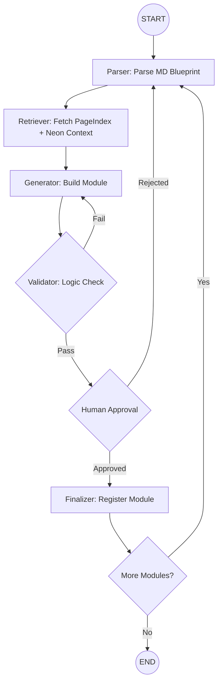

# Langgraph Single Source of Truth - Plan-Execute-Verify

To build a full ERP, your LangGraph needs to function like a Product Lifecycle Management (PLM) system. Because ERP modules (Finance, HR, Inventory) are highly interdependent, a "Linear" flow won't work -- you need a Cyclic Graph with a Central State.
The following design uses a "Plan-Execute-Verify" pattern with a persistent state object.

**All agent code is TypeScript only. No Python.**

## 1. The State Schema

In LangGraph, the State is the single source of truth. For an ERP, it must track the requirements, the context retrieved from your Vector DB, and the generated code.

```typescript
import { Annotation } from "@langchain/langgraph";

const ERPStateAnnotation = Annotation.Root({
  project_md: Annotation<string>(),           // The raw MD blueprint
  current_module: Annotation<string>(),       // e.g., "General Ledger" or "Inventory"
  business_rules: Annotation<string[]>({      // Data fetched from PageIndex + Neon pgvector
    default: () => [],
    reducer: (_prev, next) => next,
  }),
  technical_specs: Annotation<Record<string, unknown>>({  // Schema and API definitions
    default: () => ({}),
    reducer: (_prev, next) => next,
  }),
  code_artifacts: Annotation<Record<string, unknown>>({   // Generated modules
    default: () => ({}),
    reducer: (_prev, next) => next,
  }),
  validation_logs: Annotation<string[]>({     // Feedback from compliance/validator
    default: () => [],
    reducer: (_prev, next) => next,
  }),
  iteration_count: Annotation<number>({       // Guard against infinite loops
    default: () => 0,
    reducer: (_prev, next) => next,
  }),
});
```

## 2. The Node Architecture

Each node represents a specialized step in the development lifecycle. These are architectural patterns — see the actual implementation in `platform/agent-worker/src/agents/`.

**Node A: The Requirement Parser**
- Input: Raw MD project files.
- Action: Uses an LLM to break the MD into a "Dependency Map." It identifies which module to build first (e.g., you can't build "Sales" without "Items").
- Output: Updates `current_module`.

**Node B: The Context Retriever**
- Input: `current_module`.
- Action: Queries PageIndex + Neon pgvector for "Key Data."
     Example: For "Tax Module," it pulls local tax laws or specific currency conversion logic from your data.
- Output: Updates `business_rules`.

**Node C: The Module Generator**
- Input: `business_rules` + `project_md`.
- Action: A specialized LLM call that writes the SQL schemas and TypeScript logic for that specific ERP module.
- Output: Updates `code_artifacts`.

**Node D: The Validator**
- Input: `code_artifacts`.
- Action: Runs a static analysis or a "Logic Check" against the MD requirements.
- Decision:
     If Pass: Move to Human Review or the next module.
     If Fail: Send back to Generator with `validation_logs`.

## 3. Visualizing the Graph Flow



## 4. Implementation Logic (LangGraph TypeScript)

```typescript
import { Annotation, StateGraph, END, START } from "@langchain/langgraph";

// Node function signatures
async function requirementParserNode(
  state: typeof ERPStateAnnotation.State
): Promise<Partial<typeof ERPStateAnnotation.State>> {
  // Parse MD blueprint and identify next module to build
  return { current_module: "general_ledger" };
}

async function contextRetrieverNode(
  state: typeof ERPStateAnnotation.State
): Promise<Partial<typeof ERPStateAnnotation.State>> {
  // Query PageIndex + Neon pgvector for business rules relevant to current_module
  return { business_rules: [] };
}

async function moduleGeneratorNode(
  state: typeof ERPStateAnnotation.State
): Promise<Partial<typeof ERPStateAnnotation.State>> {
  // Generate TypeScript/SQL artifacts from business_rules + project_md
  return {
    code_artifacts: {},
    iteration_count: state.iteration_count + 1,
  };
}

async function qaValidatorNode(
  state: typeof ERPStateAnnotation.State
): Promise<Partial<typeof ERPStateAnnotation.State>> {
  // Validate code_artifacts against MD requirements
  return { validation_logs: [] };
}

// Routing function for conditional edge
function shouldContinue(
  state: typeof ERPStateAnnotation.State
): "retry" | "human_review" | "complete" {
  if (state.validation_logs.length > 0 && state.iteration_count < 3) {
    return "retry";
  }
  if (state.validation_logs.length === 0) {
    return "human_review";
  }
  return "complete";
}

// Build the graph
const workflow = new StateGraph(ERPStateAnnotation)
  .addNode("parser", requirementParserNode)
  .addNode("retriever", contextRetrieverNode)
  .addNode("generator", moduleGeneratorNode)
  .addNode("validator", qaValidatorNode)
  .addEdge(START, "parser")
  .addEdge("parser", "retriever")
  .addEdge("retriever", "generator")
  .addEdge("generator", "validator")
  .addConditionalEdges("validator", shouldContinue, {
    retry: "generator",
    human_review: "human_approval_node",
    complete: "parser", // Move to next module in MD
  });

const graph = workflow.compile();
```

## 5. Why this works for an ERP

- **The PageIndex + Neon pgvector Sync**: By having a dedicated retriever node, you ensure that every line of code generated is grounded in your "Key Data," preventing the LLM from inventing business logic that contradicts your company's standards.
- **Persistence**: If your development team wants to pause and discuss the "Accounts Payable" schema, the graph state is saved in your DB. You can resume exactly where the agent left off.
- **Modular Scaling**: You can add a Security Auditor node later without rewriting the entire system.

---

## Agent Instructions

- **Use this when:** Implementing the Plan-Execute-Verify agent pattern
- **Before this:** LangSmith tracing and Neon/PageIndex knowledge layer set up
- **After this:** Apply this pattern to all complex agent workflows
